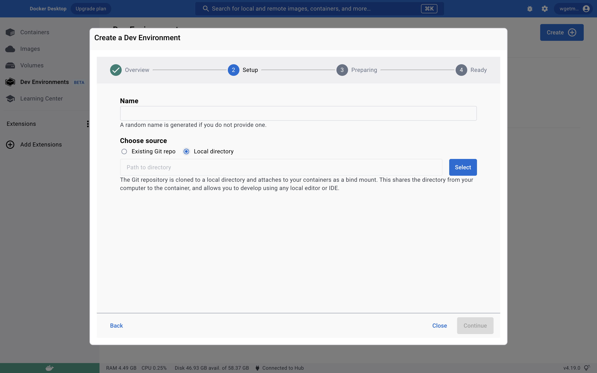

# docker dev container for rust language development

## Get Start

1. create compose-dev.yaml in your project root dir or an empty dir, following config bind ./ to /workspace.

    ```yaml
    services:
    app:
        entrypoint:
        - sleep
        - infinity
        image: wgetmeoh/rust-lang-dev-env:debian
        init: true
        volumes:
        - type: bind
        source: ./
        target: /com.docker.devenvironments.code
    ```

2. use docker dashboard create dev environment

    

    use local directory or git repo, notice your project should have compose-dev.yaml above

## Container content

This container is from image: dibian:lastest, what I prepare for rust dev environment by following steps.

* install git
* install curl
* install zsh
* install oh-mu-zsh and some plugins
* install gcc
* install rust
* install container vscode extensions: rust-analyzer and codeLLdb
